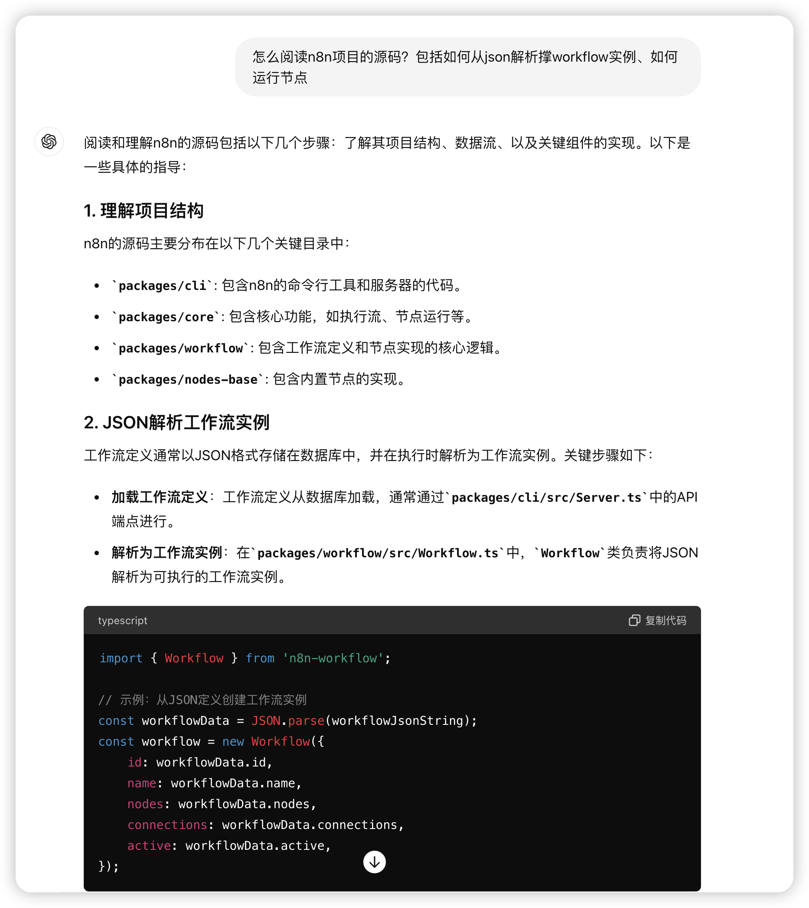

## 项目主页

https://github.com/n8n-io/n8n


## 快速部署

```
docker volume create n8n_data

docker run -it --rm --name n8n -p 5678:5678 -v n8n_data:/home/node/.n8n docker.n8n.io/n8nio/n8n
```

访问：[http://localhost:5678](http://localhost:5678/)

## 分析项目

第一次分析TS为后端语言的项目，不知道如何下手，借助GPT来看看如何分析



然后就可以根据提示去查看代码了，首先看看N8N如何定义的workflow数据结构，结合实际创建几个workflow，并使用download来查看对应的workflow实例，来分析数据结构及其含义

packages/workflow/src/Interfaces.ts

### workflow基本结构

```ts
export interface IWorkflowBase {
	id: string;  // 唯一标识
	name: string;  // workflow名称
	active: boolean;  // 是否激活状态
	createdAt: Date;  // 创建时间
	updatedAt: Date;  // 更新时间
	nodes: INode[];  // 所有的节点
	connections: IConnections;  // 节点的连接关系
	settings?: IWorkflowSettings; // 设置
	staticData?: IDataObject;  // 保存特定于工作流的静态数据，例如节点的已注册webhook的id
	pinData?: IPinData;  // 在前端画布上的位置
	versionId?: string;  // 版本号
}
```

### Node

```ts
// NodeParameterValueType 类型太多了，没有在这里展示
export interface INodeParameters {
	[key: string]: NodeParameterValueType;
}

export interface INodeCredentialsDetails {
	id: string | null;
	name: string;
}

export interface INodeCredentials {
	[key: string]: INodeCredentialsDetails;
}

export type OnError = 'continueErrorOutput' | 'continueRegularOutput' | 'stopWorkflow';
export interface INode {
	id: string;   // 节点唯一标识
	name: string;  // 节点名称
	typeVersion: number;  // 类型版本
	type: string;     // 节点类型的描述
	position: [number, number];  // 在画布上的坐标
	disabled?: boolean;  // 是否禁用当前node
	notes?: string;  // 节点注释，相当于描述信息
	notesInFlow?: boolean; // 节点注释是否显示在节点图标上
	retryOnFail?: boolean;  // 是否出错时重试
	maxTries?: number;  // 最大尝试次数
	waitBetweenTries?: number; // 尝试之间的等待时间 ms
	alwaysOutputData?: boolean; // 是否总是输出数据
	executeOnce?: boolean; // 是否执行一次，整个workflow激活期间仅仅运行一次
	onError?: OnError;  // 当出现错误时
	continueOnFail?: boolean;  // 出现错误时跳过
	parameters: INodeParameters;  // 节点动作的参数
	credentials?: INodeCredentials;  // 凭证，这个凭证是自己输入的
	webhookId?: string;  // 关联的webhookId
	extendsCredential?: string; // 扩展的凭证，这个凭证是type自带的
}
```

上面的节点的`type`树形为字符串，读取了之后，会把字符串转换成对应的类型，下面是转换后类型的接口

```ts
export interface INodeType {
	description: INodeTypeDescription;
	supplyData?(this: IAllExecuteFunctions, itemIndex: number): Promise<SupplyData>;
	execute?(
		this: IExecuteFunctions,
	): Promise<INodeExecutionData[][] | NodeExecutionWithMetadata[][] | null>;
	poll?(this: IPollFunctions): Promise<INodeExecutionData[][] | null>;
	trigger?(this: ITriggerFunctions): Promise<ITriggerResponse | undefined>;
	webhook?(this: IWebhookFunctions): Promise<IWebhookResponseData>;
	methods?: {
		loadOptions?: {
			[key: string]: (this: ILoadOptionsFunctions) => Promise<INodePropertyOptions[]>;
		};
		listSearch?: {
			[key: string]: (
				this: ILoadOptionsFunctions,
				filter?: string,
				paginationToken?: string,
			) => Promise<INodeListSearchResult>;
		};
		credentialTest?: {
			// Contains a group of functions that test credentials.
			[functionName: string]: ICredentialTestFunction;
		};
		resourceMapping?: {
			[functionName: string]: (this: ILoadOptionsFunctions) => Promise<ResourceMapperFields>;
		};
	};
	webhookMethods?: {
		[name in IWebhookDescription['name']]?: {
			[method in WebhookSetupMethodNames]: (this: IHookFunctions) => Promise<boolean>;
		};
	};
}
```

激活任务前workflow里面必须要有下面一个类型的node

- poll  轮训节点
  - GmailTrigger  配置多久时间轮训一次收到的消息
- trigger  触发器节点
  - cron 计划触发
- webhook  webhook节点
  - webhook 提供一个url，当有人调用了这个url时，触发workflow

这些都是为workflow提供初始数据的节点


还有就是操作节点

- action
  - ExecuteCommand
  - 


### connections

```ts
export const enum NodeConnectionType {
	// eslint-disable-next-line @typescript-eslint/naming-convention
	AiAgent = 'ai_agent',
	// eslint-disable-next-line @typescript-eslint/naming-convention
	AiChain = 'ai_chain',
	// eslint-disable-next-line @typescript-eslint/naming-convention
	AiDocument = 'ai_document',
	// eslint-disable-next-line @typescript-eslint/naming-convention
	AiEmbedding = 'ai_embedding',
	// eslint-disable-next-line @typescript-eslint/naming-convention
	AiLanguageModel = 'ai_languageModel',
	// eslint-disable-next-line @typescript-eslint/naming-convention
	AiMemory = 'ai_memory',
	// eslint-disable-next-line @typescript-eslint/naming-convention
	AiOutputParser = 'ai_outputParser',
	// eslint-disable-next-line @typescript-eslint/naming-convention
	AiRetriever = 'ai_retriever',
	// eslint-disable-next-line @typescript-eslint/naming-convention
	AiTextSplitter = 'ai_textSplitter',
	// eslint-disable-next-line @typescript-eslint/naming-convention
	AiTool = 'ai_tool',
	// eslint-disable-next-line @typescript-eslint/naming-convention
	AiVectorStore = 'ai_vectorStore',
	// eslint-disable-next-line @typescript-eslint/naming-convention
	Main = 'main',
}

export interface IConnection {
	// The node the connection is to
  // 连接到的节点
	node: string;

	// The type of the input on destination node (for example "main")
  // 目标节点上的输入类型（例如“main”）
	type: NodeConnectionType;

	// The output/input-index of destination node (if node has multiple inputs/outputs of the same type)
  // 目标节点的输出/输入索引（如果节点有多个相同类型的输入/输出）
	index: number;
}

// 入参是有嵌套数组的形式
export type NodeInputConnections = IConnection[][];

export interface INodeConnections {
	// Input name
	[key: string]: NodeInputConnections;  // 入参的名字
}

export interface IConnections {
	// Node name
	[key: string]: INodeConnections;  // key是node的名字
}


```

### IWorkflowSettings


```ts
export namespace WorkflowSettings {
	export type CallerPolicy = 'any' | 'none' | 'workflowsFromAList' | 'workflowsFromSameOwner';
	export type SaveDataExecution = 'DEFAULT' | 'all' | 'none';
}

// workflow的设置信息
export interface IWorkflowSettings {
	timezone?: 'DEFAULT' | string;  // 时区设置
	errorWorkflow?: string; // 当前workflow失败后，运行哪个工作流，运行的工作流应该监听失败trigger
	callerIds?: string;  
	callerPolicy?: WorkflowSettings.CallerPolicy; // 当前workflow的调用/执行策略
	saveDataErrorExecution?: WorkflowSettings.SaveDataExecution; // 失败时是否保存数据
	saveDataSuccessExecution?: WorkflowSettings.SaveDataExecution; // 成功时是否保存数据
	saveManualExecutions?: 'DEFAULT' | boolean; // 保存手动执行记录
	saveExecutionProgress?: 'DEFAULT' | boolean;  // 保存执行进度
	executionTimeout?: number;  // 超时时间
	executionOrder?: 'v0' | 'v1';  // 执行顺序
}

/**
executionOrder 选择多分支工作流的执行顺序。v0（旧版）执行每个分支的第一个节点，然后执行每个分支的第二个节点，依此类推。v1（推荐）依次执行每个分支，先完成一个分支，然后再启动另一个分支。N8n 根据分支在画布上的位置（从最上到下）对分支进行排序。如果两个分支的高度相同，则最左边的分支首先执行

*/
```

